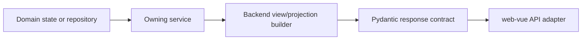

# Backend Map

Status: current

The backend exposes stable JSON projections and action results. It does not
render product HTML or transfer browser interaction ownership to Python.

## Entry points

[`../../api/app.py`](../../api/app.py) assembles five routers:

| Router | Primary surface | Principal owners |
| --- | --- | --- |
| [`api/ai.py`](../../api/ai.py) | OpenAI-compatible text, search, image, Messages, Responses, and editable-file endpoints | Protocol services, `LoggedCall`, `EditableFileTaskService` |
| [`api/accounts.py`](../../api/accounts.py) | User Keys, Upstream Accounts, Account Groups, account operations, OAuth, CPA, and Sub2API | `AuthService`, `AccountService`, import services |
| [`api/image_tasks.py`](../../api/image_tasks.py) | Studio-owned asynchronous image task endpoints | `ImageTaskService` |
| [`api/prompts.py`](../../api/prompts.py) | Prompt Library reads and Prompt Source refresh/mutation | `PromptLibraryService` |
| [`api/system.py`](../../api/system.py) | Login, version/update, settings, gallery, logs, monitor, proxy, dashboard, backup, and storage operations | Corresponding domain services and view builders |

Routers authenticate, validate transport contracts, translate expected domain
errors to HTTP responses, and call an owning service. They must not become a
second implementation of service state transitions.

### Model catalog and image compatibility

`ModelCatalogService` defaults chat models to `gpt-5.6` and `auto` and retains
explicit configured overrides. The console and `/v1/models` consume the same
catalog; listing models does not query upstream or append upstream-only entries.

`utils.helper.WEB_IMAGE_MODELS` owns the built-in Web image identifiers:
`gpt-image-2`, `gpt-image-2.5`, `gpt-image-2.5-flare`, and
`gpt-image-2.5-sunburst`. Model validation and `ModelCatalogService` consume this
list; Studio consumes the backend catalog. Explicit catalog configuration still
takes precedence over the built-in list. No `exact` aliases are added.

The 2.5 identifiers use the existing `auto` upstream Web model slug. They are
compatibility names and do not force a particular official API image engine or
quality entitlement. Existing `gpt-image-2` and Codex routing and the default
image model remain unchanged.

## Domain and persistence ownership

| Domain | Owning Module | Stable Interface/output | Persistence |
| --- | --- | --- | --- |
| Upstream Accounts and User Keys | `AccountService`, `AuthService` | Account/auth projections and batch action results | Account Repository through `DatabaseStorageBackend` |
| Settings and policy | `SettingsManagementService`, runtime configuration | Effective settings projection and mutation result | `SystemSettingsRepository` |
| Proxy routing | `ProxyManagementService`, `ProxyService` | Proxy References, groups, tests, and runtime view | `ProxyConfigurationRepository` |
| Call Records | `LoggedCall`, `CallRecordService` | Call summary/detail projections | `CallRecordRepository` |
| Active Requests and live operations | `RealtimeMonitorService` | Snapshot and call-detail records | Process memory |
| Dashboard Metric Projection | `DashboardMetricsService` | 24-hour cards and 24h / 7d / 30d chart snapshots from one hourly projection | `DashboardMetricsRepository` with state, hourly, and per-model hourly tables |
| Runtime environment | `runtime_environment_service` | One runtime snapshot | No durable state |
| Image Tasks | `ImageTaskService` | Owner-scoped task projection and terminal result | `data/image_tasks.json` |
| Image Assets and gallery | `ImageStorageService` | Asset mutation, catalogue, storage, and public URL behavior | Local/WebDAV assets plus `data/image_index.json` |
| Editable File Tasks and Assets | `EditableFileTaskService` | Owner-scoped task commands and public asset resolution | `EditableFileTaskRepository` plus filesystem assets |
| Prompt Sources and Prompt Library | `PromptLibraryService` | Revisioned merged library and source health | `PromptLibraryRepository` |
| CPA/Sub2API imports | `CPAImportService`, `Sub2APIImportService`, `RemoteImportJobCoordinator`, `RemoteAccountImportJob` | One import-job lifecycle and final batch result | Remote-import configuration repository plus Account Repository |
| Online update | `UpdateStatusService`, `UpdateService` | Availability projection and update-task lifecycle | GitHub Release metadata, managed runtime directory, `data/update_task.json` |

The repositories share the engine created by
[`../../services/application_database.py`](../../services/application_database.py)
but retain separate domain interfaces and transaction ownership.

## Projection boundary

- A projection resolves precedence between persisted state, credentials, and
  runtime outcomes before returning final labels, tones, capabilities, and
  allowed actions.
- Contract models validate that output. Vue consumes it and owns presentation;
  it does not recompute the business decision.
- A command result represents the completed action or accepted asynchronous
  task. Polling and retry ownership must be explicit for asynchronous work.

## Shared infrastructure

| Module | Role | Boundary |
| --- | --- | --- |
| `services/application_database.py` | Resolves SQLite/PostgreSQL and owns shared SQLAlchemy engines | Infrastructure only; it does not merge repositories |
| `services/storage/factory.py` | Constructs the Account Repository adapter | It is not a global storage switch |
| `services/storage/file_lock.py` | Coordinates file-backed mutations | Used only by file-backed owners |
| `services/bounded_task_runner.py` and account-processing modules | Bound process work | Their capacity is not image-generation concurrency |
| `api/*_contract.py` | Stable transport validation | Contracts do not own domain state transitions |

Use [`critical-flows.md`](critical-flows.md) when a change crosses these
boundaries; use CodeGraph only to discover additional callers and verify them
against source.
